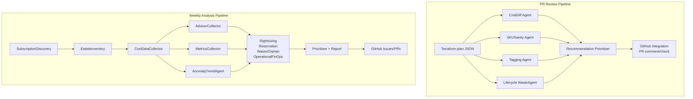

# Azure FinOps Multi-Agent Suite

A production-grade collection of Python agents that enforce cloud cost governance across your Azure estate — both at PR time (via Terraform plan analysis) and on a weekly cadence (full estate scan).

## Architecture



## Agents

### PR Review Agents (`agents/pr/`)

| Agent | Description |
| --- | --- |
| `PRCostDiffAgent` | Estimates monthly cost delta from Terraform plan using Azure Retail Prices API |
| `PRSKUSanityAgent` | Flags oversized VMs, premium disks, AKS over-provisioning in non-prod |
| `PRTaggingAgent` | Enforces required tag compliance; advisory or blocking mode |
| `PRLifecycleWasteAgent` | Detects missing shutdown schedules, orphaned resources, high retention |

### Weekly Analysis Agents (`agents/weekly/`)

| Agent | Description |
| --- | --- |
| `SubscriptionDiscoveryAgent` | Enumerates subscriptions from Management Groups |
| `EstateInventoryAgent` | Full Azure estate inventory via Resource Graph |
| `CostDataCollector` | Collects cost data from Cost Management exports or API |
| `AdvisorCollector` | Gathers Azure Advisor Cost/Operational/Reliability recommendations |
| `MetricsCollector` | Collects CPU, memory, disk, network metrics from Azure Monitor |
| `RightsizingAgent` | Identifies over-provisioned VMs, databases, App Service Plans |
| `ReservationAgent` | Recommends Reserved Instances and Azure Savings Plans |
| `WasteOrphanAgent` | Finds unattached disks, orphaned NICs, idle load balancers, old snapshots |
| `OperationalFinOpsAgent` | Checks autoscale, AKS bin-packing, Log Analytics costs, storage redundancy |
| `AnomalyTrendAgent` | Detects WoW cost spikes, new services, budget burn rate |
| `RecommendationPrioritiser` | Scores and categorises all recommendations (0-100 scale) |
| `ReportAgent` | Generates comprehensive markdown weekly report |
| `GitHubIntegrationAgent` | Posts PR comments, creates issues and check annotations |

## Installation

```bash
# Clone the repository
git clone https://github.com/your-org/finops-agents.git
cd finops-agents

# Create a virtual environment
python -m venv .venv
source .venv/bin/activate  # or .venv\Scripts\activate on Windows

# Install dependencies
pip install -r requirements.txt
```

## Configuration

Copy the example config and fill in your values:

```bash
cp config/config.yaml.example config/config.yaml
```

Key environment variables:

| Variable | Description |
| --- | --- |
| `AZURE_CLIENT_ID` | Service principal client ID |
| `AZURE_CLIENT_SECRET` | Service principal secret |
| `AZURE_TENANT_ID` | Azure tenant ID |
| `GITHUB_TOKEN` | GitHub PAT with repo/issues/PR permissions |
| `COST_EXPORT_STORAGE_ACCOUNT` | Storage account name for Cost Management exports |
| `INFRACOST_API_KEY` | Optional: Infracost API key for richer cost estimates |

## Running PR Review

### Standalone CLI

```bash
# Generate Terraform plan JSON first
terraform plan -out=tfplan
terraform show -json tfplan > tfplan.json

# Run FinOps PR review
python -m entrypoints.pr_review \
  --plan-json tfplan.json \
  --mode advisory \
  --github-token "$GITHUB_TOKEN" \
  --repo "your-org/your-repo" \
  --pr-number 42
```

### As a Reusable GitHub Actions Workflow

```yaml
# In your repository's CI workflow:
jobs:
  finops:
    uses: your-org/finops-agents/.github/workflows/pr-finops-review.yml@main
    with:
      plan_json_path: tfplan.json
      mode: advisory
      blocking_on_tagging: false
    secrets: inherit
```

## Running Weekly Analysis

### Standalone CLI

```bash
python -m entrypoints.weekly_analysis \
  --management-groups mg-root \
  --output-dir ./reports \
  --github-token "$GITHUB_TOKEN" \
  --repo "your-org/your-repo" \
  --create-issues
```

### As a Reusable GitHub Actions Workflow

```yaml
jobs:
  finops-weekly:
    uses: your-org/finops-agents/.github/workflows/weekly-estate-analysis.yml@main
    with:
      management_groups: "mg-prod mg-nonprod"
      create_issues: true
    secrets: inherit
```

## Recommendation Schema

Every recommendation has the following key fields:

| Field | Description |
| --- | --- |
| `id` | Unique ID, e.g. `finops.azure.vm.rightsize.001` |
| `recommendation_type` | `rightsize \| reserve \| waste \| operational \| anomaly \| tagging \| sku \| lifecycle` |
| `estimated_monthly_saving` | Estimated GBP saving per month |
| `confidence` | `high \| medium \| low` |
| `risk` | `high \| medium \| low` |
| `effort` | `high \| medium \| low` |
| `reversibility` | `high \| medium \| low` |
| `priority_score` | 0–100 composite score |
| `action.category` | `auto_fix_candidate \| create_pr \| create_issue \| needs_owner_review \| finance_approval_required \| suppressed \| accepted_waste` |

### Priority Scoring Model

| Dimension | Weight | Notes |
| --- | --- | --- |
| Estimated monthly saving | 0–40 | £2,000+/mo = 40 pts |
| Confidence | 0–20 | high=20, medium=12, low=4 |
| Effort (inverse) | 0–15 | low effort = 15 pts |
| Risk (inverse) | 0–15 | low risk = 15 pts |
| Reversibility | 0–10 | high reversibility = 10 pts |

### Action Category Thresholds

| Category | Criteria |
| --- | --- |
| `finance_approval_required` | Saving ≥ £2,000/month |
| `auto_fix_candidate` | Saving ≥ £500/month + low risk + low/medium effort |
| `create_pr` | Saving ≥ £100/month + low/medium risk + low/medium effort |
| `needs_owner_review` | Low confidence OR high risk |
| `create_issue` | Everything else (default) |

## Adding New Agents

1. Create a new file in `agents/pr/` or `agents/weekly/`.
2. Implement a class with an `analyse()` method returning `list[Recommendation]`.
3. Add the agent to the appropriate entrypoint in `entrypoints/`.
4. Write tests in `tests/`.

```python
from models.recommendation import Recommendation

class MyNewAgent:
    AGENT_NAME = "weekly.my_new_agent"

    def analyse(self, resources: list[dict], ...) -> list[Recommendation]:
        recommendations = []
        for res in resources:
            # ... your analysis logic ...
            recommendations.append(Recommendation(
                id=f"finops.weekly.my_agent.{uuid.uuid4().hex[:8]}",
                agent=self.AGENT_NAME,
                recommendation_type="operational",
                # ... other fields ...
            ))
        return recommendations
```

## Running Tests

```bash
pytest tests/ -v --tb=short
```

## Contributing

1. Fork the repository.
2. Create a feature branch: `git checkout -b feat/my-new-agent`.
3. Write your agent with full docstrings and type hints.
4. Add tests in `tests/` — all Azure SDK calls must be mocked.
5. Run `pytest tests/ -v` and ensure all tests pass.
6. Open a pull request — the FinOps PR review workflow will automatically run!
Azure-specialised FinOps agents for use with GitHub Agentic Workflows
